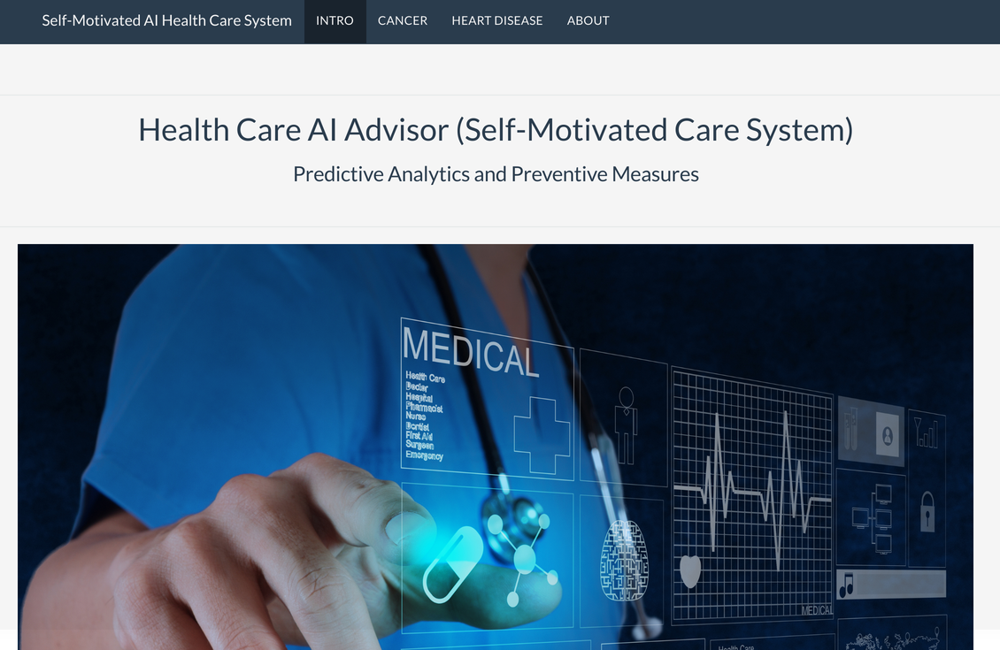
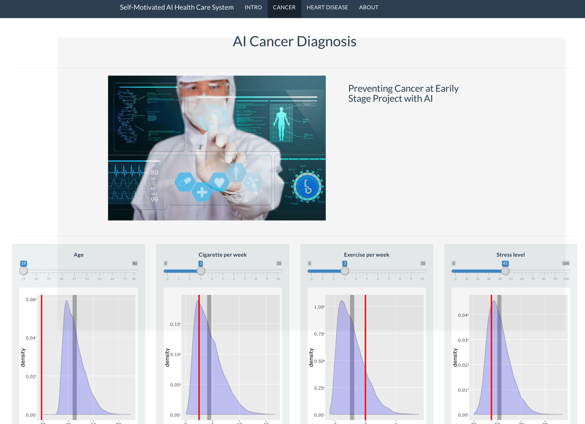
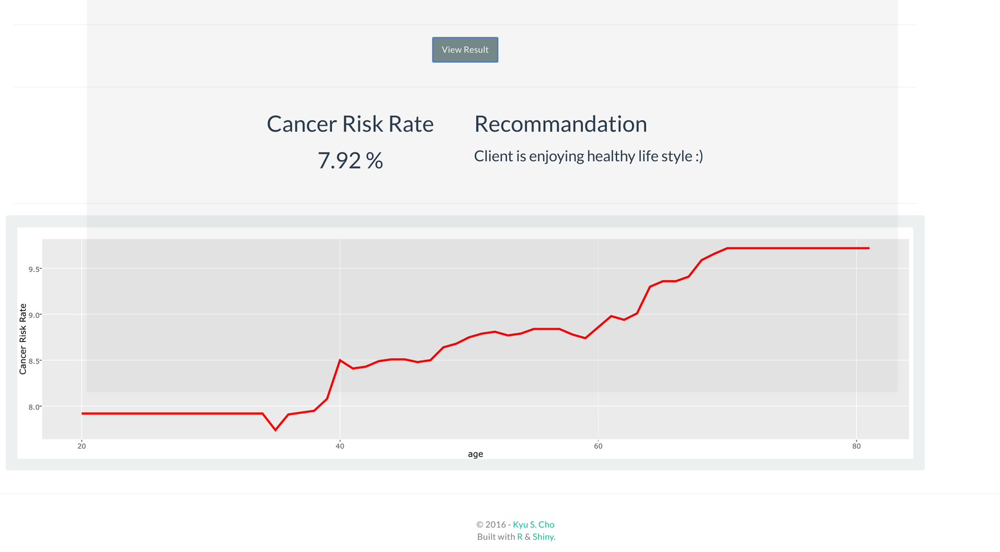

# Health Advisor (Self-Motivated Care System) 
- Predictive Analytics and Preventive Measures 

## [Introduction]

Why did i build this platform?
Imagine we can prevent any potential disease and know sooner than the doctor?
The average cost of health check up is about 188 dollar. What if we can save that money forever, also have unlimited access to free health check up.
Imagine if we have access to AI-diagnosis system regarding all kinds of diseases?
Imagine if we have personal one-to-one health care assistant who guides and encourage us and have healthier life?
This web-app is the prototype of those futuristic idea.

## [Web-App]
Initially user input their data and see the prediction of having one of the disease.
They can also change the input data they just plugged in to see the outcome.
At the end, AI provides specific recommendation to improve the health status.
This idea is inspired by Deep Neuron Network
Note: We are trying to avoid the false negative so over 50% of risk -> recommend to check out with doctor 

## [Patient's view]
1. Easily accessible 
2. Prevent the expansion of the disease at early stage for free
3. No more over examination.

## [Business view]
Insurance rate will be dropped; 
1. Patients do not over examine which leads to lower medical bill.
2. The app acknowledges patients the importance of healthier life style and encourages them to improve it and insurance company tends to charge less to people who has healthy life style.

## [Extensibility]
In this prototype, we only have 2 diseases but in the future, we could have more disease choices.
Able to improve it for the professional area with much more advance functionalities and analytic tools.
If we can have access to extracting more advance data such as gnomic data with personal home devices, it will significantly advance the predictive analytic advantages.

## [Scalability]
Each diseases diagnosis is embedded as a module; therefore, updating, deleting, adding predictors does not requires major re-engineering.
Also, each module can be easily embedded in any HTML iframe.

## [Conclusion]
Is AI reliable? 
AI and machine learning has the capacity to hugely enhance our ability to diagnose illnesses and to understand how to treat them better.
Also, one of the projects within this new health care enterprise involves utilizing machine learning and come up with a treatment plan for individual cancer patients.

Millions of people are losing lives because they inevitably missed to cure the disease at easily stage and advance version if this prototype will prevent those loses in the future and will guide us to achieve healthier life style.
