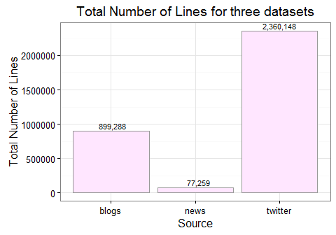
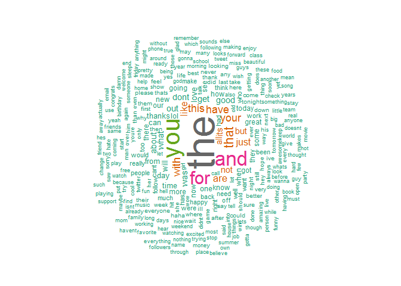
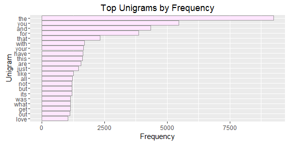

# Assignment: Data Science Capstone Milestone Report
Kyu Cho  
April 28, 2016  


## Introduction

This data dcience capstone milestone report will cover with the basics, analyzing a large corpus of text documents obtainted from [Swiftkey](https://swiftkey.com/en) to discover the structure in the given data and how words are put together. For data pre-processing, the corpus will be cleaned and analyzed. Based on the processed data, data will be sampled to build the predictive text model.

**SwiftKey** is one of the most popular smartphone keyboard apps available for both Android and iOS devices. Swiftkey has been installed in more than 300 million devices. SwiftKey estimates that its users have saved nearly 10 trillion keystrokes, across 100 languages, saving more than 100,000 years in combined typing time.

The Capstone training data can be downloaded from the link below:

https://d396qusza40orc.cloudfront.net/dsscapstone/dataset/Coursera-SwiftKey.zip

<div style="width:557px; height=487px">

</div>

## Reading the data


```r
setwd("E:/Google Drive/College/1-Data Science/17-Capston")

twitter <- readLines(con <- file("./data/en_US.twitter.txt"), encoding = "UTF-8", skipNul = TRUE)
close(con)

blogs <- readLines(con <- file("./data/en_US.blogs.txt"), encoding = "UTF-8", skipNul = TRUE)
close(con)

news <- readLines(con <- file("./data/en_US.news.txt"), encoding = "UTF-8", skipNul = TRUE)
close(con)
```
## Data Exploratory

Basic data exploratory of the three datasets have been conducted by exploring properties such as:

- total number of lines
- number of words
- file sizes


```
## Warning: package 'ggplot2' was built under R version 3.2.4
```




## Data Preprocessing

The data preprocessing includes process such data cleaning, removal of profanity text and tokenization. The preprocessed data will be saved as .RData files that will be used later. The processed data will be used for building n-grams later. The following are the preprocessing tasks:

- Removal of all illegal characters/emojis/Non-ASCII
- Sampling of 1% for three datasets
- Convert text to Lower case
- Removal of all Numbers
- Removal of all Punctuations
- Removal of Whitespace
- Removal of Profanity words
- Convert final corpus to plain text document

The preprocessing is mainly performed by using the **tm** (text mining) package. 


## Frequency of words and N-grams

Wordcloud for top 300 words




Tokenize corpus sample into Unigrams, Bigrams and Trigrams


```r
library(RWeka)
unigram_token <- function(x)
  NGramTokenizer(x, Weka_control(min = 1, max = 1))
bigram_token <- function(x)
  NGramTokenizer(x, Weka_control(min = 2, max = 2))
trigram_token <- function(x)
  NGramTokenizer(x, Weka_control(min = 3, max = 3))
fourgram_token <- function(x)
  NGramTokenizer(x, Weka_control(min = 4, max = 4))
fivegram_token <- function(x)
  NGramTokenizer(x, Weka_control(min = 5, max = 5))

#finding unigram
unigram <- TermDocumentMatrix(doc.corpus, control=list(tokenize=unigram_token))
#finding bigram
bigram <- TermDocumentMatrix(doc.corpus, control=list(tokenize=bigram_token))
#finding trigram
trigram <- TermDocumentMatrix(doc.corpus, control=list(tokenize=trigram_token))
#finding fourgram
fourgram <- TermDocumentMatrix(doc.corpus, control=list(tokenize=fourgram_token))
#finding fivegram
fivegram <- TermDocumentMatrix(doc.corpus, control=list(tokenize=fivegram_token))
```


Bar plots showing mhe ost frequently occurring n-grams


## Algorithm and Data Product

For the data product, the application will be developed and deployed on a **Shiny** server. Using the n-grams, the nearest next word can be predicted. In order to improve the efficiency of the prediction, back-off model will be used.  

The main functionalities of the proposed Shiny app:

- Users will be able to type input to the Shiny app.
- Based on user's text input, the app will be able to return at least 1 to 3 predicted words and display to the user.
