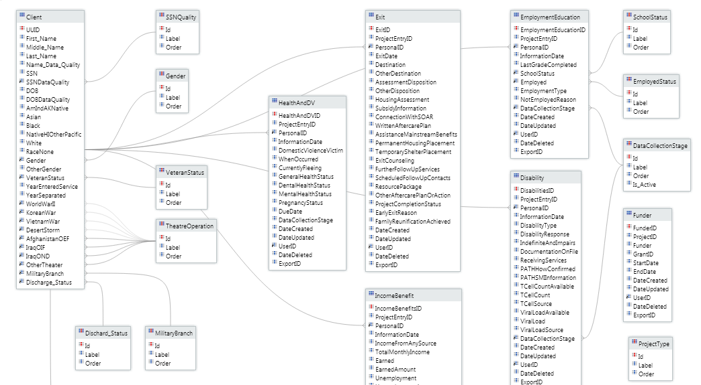

# Introduction
image:  

# Data list
Client.csv  
Disabilities.csv  
EmploymentEducation.csv  
Enrollment.csv  
Exit.csv  
HealthAndDv.csv  
IncomeBenefits.csv  
Services.csv  

 
image: 

# Table of Contents
1. Load Data
2. Cleaning Missing or Unnecessary features
3. Feature Engeering
    + Client.csv
    + Disabilities.csv
    + EmploymentEducation.csv
    + Enrollment.csv
    + Exit.csv
    + HealthAndDV.csv
    + IncomeBenefits.csv
    + Services.csv
4. Save Semi-Cleaned Data
5. Merging data sets
6. Imputing missing data after 'join'
7. Visualization
8. Feature Selection
9. Processing Hyper-parameter Tunning with Cross-Validation
10. Building Model
11. Save Models
12. Sql Query 
13. Final Anlysis

# Load Data
```{r cache=T}
setwd("C:/Users/Kyu/Google Drive/Portfolio/Global Hackathon 6/data")

Client <- read.csv("Client.csv", na.strings=c("", " ", "NULL", NA), stringsAsFactors=FALSE)
Disabilities <- read.csv("Disabilities.csv", na.strings=c("", " ", "NULL", NA))
EmploymentEducation <- read.csv("EmploymentEducation.csv", na.strings=c("", " ", "NULL", NA))
Enrollment <- read.csv("Enrollment.csv", na.strings=c("", " ", "NULL", NA))
Exit <- read.csv("Exit.csv", na.strings=c("", " ", "NULL", NA))
HealthAndDV <- read.csv("HealthAndDV.csv", na.strings=c("", " ", "NULL", NA))
IncomeBenefits <- read.csv("IncomeBenefits.csv", na.strings=c("", " ", "NULL", NA))
Services <- read.csv("Services.csv", na.strings=c("", " ", "NULL", NA))
```

# Cleaning Missing or Unnecessary features

```{r cache=T}
no_use_col <- c("DateCreated", "DateUpdated", "UserID", "ExportID", "ProjectEntryID")

# Since, these data sets are very imbalance, i will delete them
Client$First_Name <- NULL
Client$Middle_Name <- NULL
Client$Last_Name <- NULL
Client$SSN <- NULL
Client$OtherGender <- NULL
Client$Name_Data_Quality <- NULL
Client$SSNDataQuality <- NULL
Client$DOBDataQuality <- NULL
names(Client)[1] <- paste("PersonalID") # change UUID to PersonalID for joining dataset purpose
sapply(Client, function(x){sum(is.na(x))/length(x)})*100

# remove ~50% missing values. 
cat_Disabilities <- sapply(Disabilities, function(x){sum(is.na(x))/length(x)})*100
Disabilities <- subset(Disabilities, select = cat_Disabilities < 5 )
Disabilities <- Disabilities[, !colnames(Disabilities) %in% no_use_col]
Disabilities$DisabilitiesID <- NULL
sapply(Disabilities, function(x){sum(is.na(x))/length(x)})*100

# remove ~50% missing values. 
cat_EmploymentEducation <- sapply(EmploymentEducation, function(x){sum(is.na(x))/length(x)})*100
EmploymentEducation <- subset(EmploymentEducation, select = cat_EmploymentEducation < 5 )
EmploymentEducation <- EmploymentEducation[, !colnames(EmploymentEducation) %in% no_use_col]
EmploymentEducation$EmploymentEducationID <- NULL
sapply(EmploymentEducation, function(x){sum(is.na(x))/length(x)})*100

# remove ~50% missing values. 
cat_Enrollment <- sapply(Enrollment, function(x){sum(is.na(x))/length(x)})*100
Enrollment <- subset(Enrollment, select = cat_Enrollment < 5 )
Enrollment <- Enrollment[, !colnames(Enrollment) %in% no_use_col]
Enrollment$HouseholdID <- NULL
Enrollment$ProjectID <- NULL
sapply(Enrollment, function(x){sum(is.na(x))/length(x)})*100

# remove ~50% missing values. 
cat_Exit <- sapply(Exit, function(x){sum(is.na(x))/length(x)})*100
Exit <- subset(Exit, select = cat_Exit < 5 )
Exit <- Exit[, !colnames(Exit) %in% no_use_col]
Exit$ExitID <- NULL
sapply(Exit, function(x){sum(is.na(x))/length(x)})*100

# remove ~50% missing values. 
cat_HealthAndDV <- sapply(HealthAndDV, function(x){sum(is.na(x))/length(x)})*100
HealthAndDV <- subset(HealthAndDV, select = cat_HealthAndDV < 5 )
HealthAndDV <- HealthAndDV[, !colnames(HealthAndDV) %in% no_use_col]
HealthAndDV$HealthAndDVID <- NULL
HealthAndDV$DueDate <- NULL
sapply(HealthAndDV, function(x){sum(is.na(x))/length(x)})*100

# remove ~50% missing values. 
cat_IncomeBenefits <- sapply(IncomeBenefits, function(x){sum(is.na(x))/length(x)})*100
IncomeBenefits <- subset(IncomeBenefits, select = cat_IncomeBenefits < 5 )
IncomeBenefits <- IncomeBenefits[, !colnames(IncomeBenefits) %in% no_use_col]
IncomeBenefits$IncomeBenefitsID <- NULL
sapply(IncomeBenefits, function(x){sum(is.na(x))/length(x)})*100

# remove ~50% missing values. 
cat_Services <- sapply(Services, function(x){sum(is.na(x))/length(x)})*100
Services <- subset(Services, select = cat_Services < 5 )
Services <- Services[, !colnames(Services) %in% no_use_col]
Services$ServicesID <- NULL
sapply(Services, function(x){sum(is.na(x))/length(x)})*100
```

# Feature Engeering

1. Extracting important variables from the existing variables
2. Impute missing data uising proper method.
3. Dummyfy categorical data
4. Remove zero variant variables
5. Create new features

## Client.csv
```{r cache=T, message=FALSE, warning=FALSE}
library(mlr)
library(lubridate) # for data
library(caret)

dim(Client)
str(Client)
summarizeColumns(Client)

# check if the ID is unique in the dataset
nrow(Client) == length(table(Client$PersonalID))

# extracting the DBO year
Client$DOB <- as.POSIXct(strptime(Client$DOB, format="%m/%d/%Y"))
Client$DOByear <- year(Client$DOB)
Client$DOB <- NULL

# cleaning YearEnteredService and YearSeparated 
# impute missing values by mean and mode
Client$YearEnteredService[is.na(as.numeric(Client$YearEnteredService))] <- mean(Client$YearEnteredService, na.rm=T)
Client$YearSeparated[is.na(as.numeric(Client$YearSeparated))] <- mean(Client$YearSeparated, na.rm=T)

# change to factor variables
non_fector = c("PersonalID", "Name_Data_Quality", "SSNDataQuality", "DOBDataQuality", "YearEnteredService", "YearSeparated", "DOByear")
for(i in names(Client[,!colnames(Client) %in% non_fector])) { 
    Client[,names(Client) == i ] <- as.factor(Client[,names(Client) == i ])
}

# cleaning Gender var
# Since Gender has very imbalance dataset, I'm going to bin minority genders
levels(Client$Gender)[levels(Client$Gender) %in% 2] <- 1
levels(Client$Gender)[levels(Client$Gender) %in% 3] <- 1
levels(Client$Gender)[levels(Client$Gender) %in% 9] <- 1
levels(Client$Gender)[levels(Client$Gender) %in% 99] <- 1
table(Client$Gender, useNA = "always")

# cleaning MilitaryBranch var
# create another level of factor for missing data
Client$MilitaryBranch <- as.numeric(Client$MilitaryBranch)
Client$MilitaryBranch[is.na(Client$MilitaryBranch)] <-  0
Client$MilitaryBranch <- as.factor(Client$MilitaryBranch)

# Bin minority Military Branch factors
levels(Client$MilitaryBranch)[levels(Client$MilitaryBranch) %in% 3] <- 2
levels(Client$MilitaryBranch)[levels(Client$MilitaryBranch) %in% 4] <- 2
table(Client$MilitaryBranch, useNA = "always")

# cleaning Discharge_Status var
# create another level of factor for missing data
Client$Discharge_Status <- as.numeric(Client$Discharge_Status)
Client$Discharge_Status[is.na(Client$Discharge_Status)] <-  0
Client$Discharge_Status <- as.factor(Client$Discharge_Status)

# Bin minority Discharge_Status fators
levels(Client$Discharge_Status)[levels(Client$Discharge_Status) %in% 3] <- 2
levels(Client$Discharge_Status)[levels(Client$Discharge_Status) %in% 4] <- 2
levels(Client$Discharge_Status)[levels(Client$Discharge_Status) %in% 5] <- 2
table(Client$Discharge_Status, useNA = "always")

# cleaning DOByear var
Client$DOByear[is.na(Client$DOByear)] <- median(Client$DOByear, na.rm=T)

sapply(Client, function(x){sum(is.na(x))/length(x)})*100

Client$Black <- NULL
Client$White <- NULL

# convert them into dummy variables
dummies <- dummyVars("~ Gender + VeteranStatus + MilitaryBranch + Discharge_Status", data=Client, fullRank=T)
dummies.df <- as.data.frame(predict(dummies, Client))
Client <- cbind(Client, dummies.df)
Client$Gender <- NULL
Client$VeteranStatus <- NULL
Client$MilitaryBranch <- NULL
Client$Discharge_Status <- NULL

# change binary flag factor into numerical value again
for(i in names(Client[,!colnames(Client) %in% non_fector])) { 
    Client[,names(Client) == i ] <- as.numeric(Client[,names(Client) == i ])
}

# remove zero variance
nzCol <- nearZeroVar(Client, saveMetrics = TRUE)
Client <- Client[, nzCol$nzv == FALSE]

# cleaning age
Client$Age <- 2016 - Client$DOByear
Client[Client$Age < 18, "Age"] <- round(mean(Client$Age))

for (i in seq(length(Client$Age)))
    age <- paste(substr(Client$Age, start=0, stop=1))

Client$Age <- age
Client$YearEnteredService <- NULL
Client$YearSeparated <- NULL
Client$DOByear <- NULL
```

## Disabilities.csv
```{r cache = T}
dim(Disabilities)
str(Disabilities)
summarizeColumns(Disabilities)
# Checking if the ID is unique in the dataset
nrow(Disabilities) == length(table(Disabilities$PersonalID))

# extracting the year
Disabilities$InformationDate <- as.POSIXct(strptime(Disabilities$InformationDate, format="%m/%d/%Y"))
Disabilities$InformationDateMonth <- month(Disabilities$InformationDate)
Disabilities$InformationDate <- NULL

table(Disabilities$InformationDateYear, useNA = "always")
```

## EmploymentEducation.csv
```{r cache=T}
dim(EmploymentEducation)
str(EmploymentEducation)
summarizeColumns(EmploymentEducation)

# Checking if the ID is unique in the dataset
nrow(EmploymentEducation) == length(table(EmploymentEducation$PersonalID))

# extracting the year
EmploymentEducation$InformationDate <- as.POSIXct(strptime(EmploymentEducation$InformationDate, format="%m/%d/%Y"))
EmploymentEducation$InformationDateMonth <- month(EmploymentEducation$InformationDate)
EmploymentEducation$InformationDate <- NULL
```

## Enrollment.csv
```{r cache=T, message=FALSE, warning=FALSE}
dim(Enrollment)
str(Enrollment)
summarizeColumns(Enrollment)
# Checking if the ID is unique in the dataset
nrow(Enrollment) == length(table(Enrollment$PersonalID))

# extracting the year
Enrollment$EntryDate <- as.POSIXct(strptime(Enrollment$EntryDate, format="%m/%d/%Y"))
Enrollment$EntryDateMonth <- month(Enrollment$EntryDate)

# extracing geo information through the zipcode
library(zipcode)
data(zipcode)
Enrollment  <- merge(Enrollment, zipcode, by.x='LastPermanentZIP', by.y='zip')

Enrollment$LastPermanentStreet <- NULL
Enrollment$LastPermanentCity <- NULL
Enrollment$LastPermanentState <- NULL
Enrollment$city <- NULL
Enrollment$state <- NULL

# bin small dataset 
Enrollment[Enrollment$RelationshipToHoH == 4, 'RelationshipToHoH'] <- 3
Enrollment[Enrollment$RelationshipToHoH == 5, 'RelationshipToHoH'] <- 3
table(Enrollment$RelationshipToHoH)

Enrollment$RelationshipToHoH <- as.factor(Enrollment$RelationshipToHoH)
dummies <- dummyVars("~ RelationshipToHoH", data=Enrollment, fullRank=T)
dummies.df <- as.data.frame(predict(dummies, Enrollment))
Enrollment <- cbind(Enrollment, dummies.df)
Enrollment$RelationshipToHoH <- NULL

```

## Exit.csv
```{r cache=T}
dim(Exit)
str(Exit)
summarizeColumns(Exit)
# Checking if the ID is unique in the dataset
nrow(Exit) == length(table(Exit$PersonalID))

# extracting the year
Exit$ExitDate <- as.POSIXct(strptime(Exit$ExitDate, format="%m/%d/%Y"))
Exit$ExitDateMonth <- month(Exit$ExitDate)

table(Exit$Destination, useNA = "always")
Exit$Destination[is.na(Exit$Destination)] <-  2

# Bin some data and fit them in to 0 to 5
Exit$Destination <- as.numeric(Exit$Destination)
Exit[Exit$Destination == 7, 'Destination'] <- 1
Exit[Exit$Destination == 16, 'Destination'] <- 1
Exit[Exit$Destination == 9, 'Destination'] <- 1
Exit[Exit$Destination == 14, 'Destination'] <- 1
Exit[Exit$Destination == 2, 'Destination'] <- 1
Exit[Exit$Destination == 25, 'Destination'] <- 2
Exit[Exit$Destination == 3, 'Destination'] <- 2
Exit[Exit$Destination == 22, 'Destination'] <- 2
Exit[Exit$Destination == 23, 'Destination'] <- 3
Exit[Exit$Destination == 19, 'Destination'] <- 3
Exit[Exit$Destination == 20, 'Destination'] <- 4
Exit[Exit$Destination == 21, 'Destination'] <- 4
Exit[Exit$Destination == 12, 'Destination'] <- 4
Exit[Exit$Destination == 13, 'Destination'] <- 5
Exit[Exit$Destination == 10, 'Destination'] <- 5
Exit[Exit$Destination == 11, 'Destination'] <- 5
```

## HealthAndDV.csv
```{r cache=T}
dim(HealthAndDV)
str(HealthAndDV)
summarizeColumns(HealthAndDV)
# Checking if the ID is unique in the dataset
nrow(HealthAndDV) == length(table(HealthAndDV$PersonalID))

HealthAndDV$InformationDate <- NULL
```

## IncomeBenefits.csv
```{r cache=T}
dim(IncomeBenefits)
str(IncomeBenefits)
summarizeColumns(IncomeBenefits)
# Checking if the ID is unique in the dataset
nrow(IncomeBenefits) == length(table(IncomeBenefits$PersonalID))

# fil missing data with median
IncomeBenefits$InsuranceFromAnySource[is.na(IncomeBenefits$InsuranceFromAnySource)] <- 0 

# remove zero variance
nzCol <- nearZeroVar(IncomeBenefits, saveMetrics = TRUE)
IncomeBenefits <- IncomeBenefits[, nzCol$nzv == FALSE]

IncomeBenefits$InformationDate <- NULL
```

## Services.csv
```{r cache=T}
dim(Services)
str(Services)
summarizeColumns(Services)
# Checking if the ID is unique in the dataset
nrow(Services) == length(table(Services$PersonalID))

# binding two service groups into a unique identification
Services[Services$RecordType == 144, "RecordType"] = "A"
Services[Services$RecordType == 152, "RecordType"] = "B"
Services$TypeProvided <- paste0(Services$RecordType, as.character(Services$TypeProvided))

# bind small data together
Services[Services$TypeProvided == "A3", "TypeProvided"] <- "A5"
Services[Services$TypeProvided == "B10", "TypeProvided"] <- "B4"
Services[Services$TypeProvided == "B11", "TypeProvided"] <- "B4"
Services[Services$TypeProvided == "B14", "TypeProvided"] <- "B4"
Services[Services$TypeProvided == "B3", "TypeProvided"] <- "B4"
Services[Services$TypeProvided == "B5", "TypeProvided"] <- "B4"
Services$RecordType <- NULL
```

# Save Semi-Cleaned Data
```{r cache=T}
write.csv(Client, file = "Client_Cleaned.csv",row.names=FALSE)
write.csv(Disabilities, file = "Disabilities_Cleaned.csv",row.names=FALSE)
write.csv(EmploymentEducation, file = "EmploymentEducation_Cleaned.csv",row.names=FALSE)
write.csv(Enrollment, file = "Enrollment_Cleaned.csv",row.names=FALSE)
write.csv(Exit, file = "Exit_Cleaned.csv",row.names=FALSE)
write.csv(HealthAndDV, file = "HealthAndDV_Cleaned.csv",row.names=FALSE)
write.csv(IncomeBenefits, file = "IncomeBenefits_Cleaned.csv",row.names=FALSE)
write.csv(Services, file = "Services_Cleaned.csv",row.names=FALSE)
```

# Visualization
```{r cache=T, message=FALSE, warning=FALSE}
# Geo Map
library(maps)
library(ggmap)
library(dplyr)
ml_data <- read.csv("ml_data.csv")

# Load a map of STL into R:
STL <- get_map(location="Saint Louis", zoom=11)
LatLonCounts <- as.data.frame(table(round(Enrollment$longitude,2), round(Enrollment$latitude,2)))
LatLonCounts$Long <- as.numeric(as.character(LatLonCounts$Var1))
LatLonCounts$Lat <- as.numeric(as.character(LatLonCounts$Var2))
LatLonCounts <- subset(LatLonCounts, Freq > 0)

g1 <- ggmap(STL) +
    geom_point(data=LatLonCounts, aes(x=Long, y=Lat, color=Freq, size=Freq)) +
    scale_colour_gradient(low="yellow", high="red")

g2 <- ggmap(STL) +
    stat_density2d(data=Enrollment, aes(x=longitude, y=latitude, fill=..level..), geom="polygon", alpha=0.2) +
    scale_fill_gradient(low="yellow", high="red")

# top 10 zipcodes with most homeless people
top10_zip <- Enrollment %>% 
    group_by(LastPermanentZIP) %>% 
    count() %>% 
    top_n(10, n) %>% 
    arrange(-n)

g3 <- ggplot(ml_data, aes(EntryDateMonth)) +
    geom_histogram(binwidth = 1)

g4 <- ggplot(ml_data, aes(EntryDateMonth, fill = as.factor(Destination))) +
    geom_histogram(binwidth = 1)

g5 <- ggplot(ml_data, aes(EntryDateMonth, fill = as.factor(TypeProvided))) +
    geom_histogram(binwidth = 1)

g6 <- ggplot(ml_data, aes(EntryDateMonth, fill = as.factor(VADisabilityService))) +
    geom_histogram(binwidth = 1)
```


# Merging data sets
```{r cache=T}
library(dplyr)

# remove all the time variables
str(Client)

str(Disabilities)
Disabilities$InformationDateMonth <- NULL

str(EmploymentEducation)
EmploymentEducation$DataCollectionStage <- NULL
EmploymentEducation$InformationDateMonth <- NULL

str(Enrollment)
Enrollment$LastPermanentZIP <- NULL 
Enrollment$EntryDate <- NULL 
Enrollment$longitude <- NULL 
Enrollment$latitude <- NULL 

str(Exit)
Exit$ExitDate <- NULL
Exit$ExitDateMonth <- NULL

str(HealthAndDV)
HealthAndDV$DataCollectionStage <- NULL

str(IncomeBenefits)
IncomeBenefits$DataCollectionStage <- NULL

str(Services)
Services$DateProvided <- NULL

# Save as ML dataset
write.csv(Client, file = "Client_Cleaned_ML.csv",row.names=FALSE)
write.csv(Disabilities, file = "Disabilities_Cleaned_ML.csv",row.names=FALSE)
write.csv(EmploymentEducation, file = "EmploymentEducation_Cleaned_ML.csv",row.names=FALSE)
write.csv(Enrollment, file = "Enrollment_Cleaned_ML.csv",row.names=FALSE)
write.csv(Exit, file = "Exit_Cleaned_ML.csv",row.names=FALSE)
write.csv(HealthAndDV, file = "HealthAndDV_Cleaned_ML.csv",row.names=FALSE)
write.csv(IncomeBenefits, file = "IncomeBenefits_Cleaned_ML.csv",row.names=FALSE)
write.csv(Services, file = "Services_Cleaned_ML.csv",row.names=FALSE)

dim(Disabilities)
length(unique(Disabilities[ ,"PersonalID"]))

dim(Services)
length(unique(Services[ ,"PersonalID"]))
ml_data <- right_join(Disabilities, Services, by = "PersonalID")

dim(IncomeBenefits)
length(unique(IncomeBenefits[ ,"PersonalID"]))
ml_data <- right_join(ml_data, IncomeBenefits, by = "PersonalID")

dim(HealthAndDV)
length(unique(HealthAndDV[ ,"PersonalID"]))
ml_data <- right_join(ml_data, HealthAndDV, by = "PersonalID")

dim(Enrollment)
length(unique(Enrollment[ ,"PersonalID"]))
ml_data <- right_join(ml_data, Enrollment, by = "PersonalID")

dim(Client)
length(unique(Client[ ,"PersonalID"]))
ml_data <- right_join(ml_data, Client, by = "PersonalID")

dim(EmploymentEducation)
length(unique(EmploymentEducation[ ,"PersonalID"]))
ml_data <- right_join(ml_data, EmploymentEducation, by = "PersonalID")

dim(Exit)
length(unique(Exit[ ,"PersonalID"]))
ml_data <- right_join(ml_data, Exit, by = "PersonalID")
```

# Imputing missing data after 'join'

```{r cache=T}
library(caTools)
# ml_data$Destination <- as.factor(ml_data$Destination)

# drop na values
ml_data <- ml_data[complete.cases(ml_data),]
round(sapply(ml_data, function(x){sum(is.na(x))/length(x)})*100, 3)
ml_data$PersonalID <- NULL
ml_data$TypeProvided <- as.factor(ml_data$TypeProvided)

# save combined data
write.csv(ml_data, file = "ml_data.csv",row.names=FALSE)

# Spliting data
subsetD <- ml_data
# subsetD <- sample(ml_data)[0:5000,]
set.seed(2000)
split <- sample.split(subsetD$Destination, SplitRatio=0.7)
train <- subset(subsetD, split==TRUE)
test <- subset(subsetD, split==FALSE)
```


# Feature Selection
```{r cache=T}
# load library for machine learning
library(mlr)
library(FSelector)

# create task
train.task <- makeClassifTask(data=train, target="Destination")
test.task <- makeClassifTask(data=test, target="Destination")

# remove zero variance features
train.task <- removeConstantFeatures(train.task)
test.task <- removeConstantFeatures(test.task)

# get variable importance chart
var_imp <- generateFilterValuesData(train.task, method=c("information.gain"))
# plotFilterValues(var_imp, feat.type.cols=TRUE)

# select only important variables
imp_feat <- (var_imp$data %>% arrange(-information.gain) %>% top_n(7))$name
imp_feat <- c(imp_feat, "Destination") # add target variable

# create task
train <- train[ ,colnames(train) %in% imp_feat]
test <- test[ ,colnames(test) %in% imp_feat]
                
trainTask <- makeClassifTask(data=train, target="Destination")
testTask <- makeClassifTask(data=test, target="Destination")

```

# Processing Hyper-parameter Tunning with Cross-Validation

```{r cache=T}
getParamSet("classif.randomForest")

# create a learner
rf <- makeLearner("classif.randomForest", predict.type="response", par.vals=list(ntree=200, mtry=3))
rf$par.vals <- list(importance=TRUE)

# set tunable parameters
# grid search to find hyperparameters
rf_param <- makeParamSet(makeIntegerParam("ntree", lower=5, upper=10),
                         makeIntegerParam("mtry", lower=5, upper=10),
                         makeIntegerParam("nodesize", lower=25, upper=50))

#  random search for 50 iterations
rancontrol <- makeTuneControlRandom(maxit=50L)

# set 3 fold cross validation
set_cv <- makeResampleDesc("CV", iters=3L)
 
# hypertuning
# rf_tune <- tuneParams(learner=rf, resampling=set_cv, task=train.task, par.set=rf_param, control=rancontrol, measures=acc)
```

# Building Model

```{r cache=T}
library(randomForest)
## best parameters
# rf_tune$x
# $ntree
# [1] 9
# $mtry
# [1] 5
# $nodesize
# [1] 40

## cv accuracy
# rf_tune$y
# acc.test.mean 
#     0.8829761 

# using hyperparameters for modeling
# rf.tree <- setHyperPars(rf, par.vals=rf_tune$x)

# train a model
# rforest <- train(rf.tree, trainTask)
# getLearnerModel(t.rpart)

# make predictions
# rfmodel <- predict(rforest, test.task)


mdl.rf <- randomForest(as.factor(Destination) ~ .,
                       data = train,
                       replace = F, ntree = 9,
                       do.trace = F, mtry = 5, nodesize = 40)

pred.rf.test <- predict(mdl.rf, test)
conf.mtx <- confusionMatrix(pred.rf.test, test$Destination)
conf.mtx
```

# Save Models

```{r cache=T}
save(mdl.rf, file = "mdl.rf.RData")
save(conf.mtx, file = "conf.mtx.RData")
save(test, file = "test.RData")
save(top10_zip, file = "top10_zip.RData")
save(g1, file = "g1.RData")
save(g2, file = "g2.RData")
save(var_imp, file = "var_imp.RData")
```

# Sql Query 
```{r cahce=T}
# library("RMySQL")
# 
# # GET THAT DATABASE CONNECTION 
# mydb <- dbConnect(RMySQL::MySQL(), user='GHack', password='GlobalHack123!', 
#                dbname='globalhack', host='Globalhack.il1.rdbs.ctl.io', port=49424)
# 
# # FETCH NAMES & ADDRESSES!  
# result <- dbSendQuery(mydb, "select * 
#                 from CleanClient c
#                 LEFT JOIN (select * from CleanDisabilities group by CleanDisabilities.PersonalID) d on c.PersonalID = d.PersonalID")
# names <- fetch(result, n=-1) 
# dbClearResult(result) 
```

# Final Analysis


# Homelessness Garph Analytics

```{r cache=T, echo=FALSE, warning=FALSE}
g3
```

- As we see, we have sessional pattern here.
- More people comes to the center during summer and winter
- Less people during Spring and fall
- We need more resources during peak sesson to ensure that we can provide the quality services.

```{r cache=T,  warning=FALSE, echo=FALSE}
g4
```

- Higher the factor number means better result after they competed the program.
- We have great result dsuring the summer but not so good result during the winter.
- Let's see why is that the case.

```{r cache=T, echo=FALSE}
g5
```

- Factor variables are representing specific service they have received during the enrollment.
- We know that during the summer, the program does great job and 'A2' services are offered the most during the summer. (A2 = Community service/service learning (CSL))
- During the winter session, we offer less 'A2/ service and more 'B1' services. We might need to change the service stratagies. (B1 = Rental assistance)


```{r cache=T, echo=FALSE}
g6
```

- Most of the clients during the summer receive VA Disability Service which could be the potensial reason why we have such a great outcome during the summer. correlation but not causation.

# Heat Map Graph Analytics

```{r cache=T,  warning=FALSE, echo=FALSE}
g2
g1
```

- This map represents the intensity of the homelessness.
- More freqeunt homelessness has bigger diameter of the circle.
- Let see which area needs more resources.

```{r cache=T, echo=FALSE}
print("Top 10 the Most Homelessness Area")
paste(top10_zip$LastPermanentZIP)
```

- Above zip code is the top 10 zipcodes where the homelessness is frequently occuring.
- According to these information, we can distribute available resources more intelligently for higher quality services.

# Predictive modeling
- If we can predict the successfulness of the client prior to the service enrollment, then it is greatly beneficial for the center for having a chance to improve the 1 to 1 service if it predicts the negative outcomes. 
- However, the current data sets have too much features which the model does not need them all.
- Let's plot the most important features to select the best predictor variables. 

```{r cache=T, echo=FALSE}
plotFilterValues(var_imp, feat.type.cols=TRUE)
imp_feat <- (var_imp$data %>% arrange(-information.gain) %>% top_n(7))$name
imp_feat
```

- We already analized some of the variables previously and found some significant intuition.
- As long as we have those 7 variables, we can make great predictive model.
- Let's do some demonstration

```{r cache=T, echo=FALSE}
head(test, 3)
pred.rf.test <- predict(mdl.rf, test)
conf.mtx <- confusionMatrix(pred.rf.test, test$Destination)
conf.mtx$overall
```

- As you can see, we have over 86% of accuracy to determine the successfulness of the particular individual prior to the enrollment without collecting too much data.

# Improvement TODO:
- Explore more featurese and perform decent feature engineering process.
- Construct Deep Neuron Network through tensorflow to build more compelx predictive model.
- Use Spark distributed computing system to find the best hyper-parameters for Deep Neuron Network.

# Challenges of this project
- Cleaning multiple, exreamly dirty, and small dataset and merging them into descent size was one of the challenges. 

