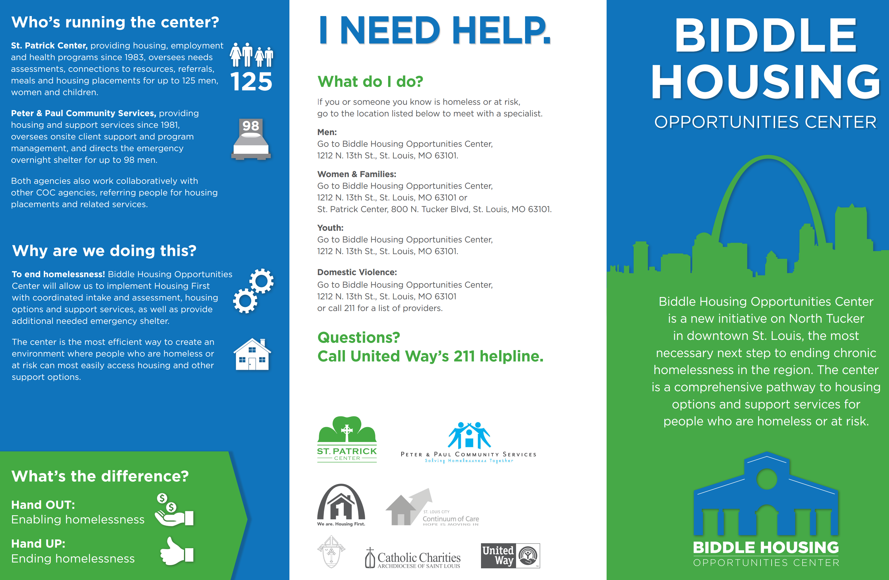

```{r setup, include=FALSE}
library(ggplot2)
library(mlr)
library(randomForest)
library(caret)
library(dplyr)

setwd("C:/Users/Kyu/Google Drive/Portfolio/Global Hackathon 6/data")
ml_data <- read.csv("ml_data.csv")

load('g1.RData')
load('g2.RData')
load('mdl.rf.RData')
load('conf.mtx.RData')
load('test.RData')
load('top10_zip.RData')
load('var_imp.RData')
load('mdl.rf.RData')
```

# Homelessness Garph Analytics


image:  


```{r cache=T, echo=FALSE, warning=FALSE}
ggplot(ml_data, aes(EntryDateMonth)) + geom_histogram(binwidth = 1)
```

- As we see, we have sessional pattern here.
- More people comes to the center during summer and winter
- Less people during Spring and fall
- We need more resources during peak sesson to ensure that we can provide the quality services.

```{r cache=T,  warning=FALSE, echo=FALSE}
ggplot(ml_data, aes(EntryDateMonth, fill = as.factor(Destination))) + geom_histogram(binwidth = 1)
```

- Higher the factor number means better result after they competed the program.
- We have great result dsuring the summer but not so good result during the winter.
- Let's see why is that the case.

```{r cache=T, echo=FALSE}
ggplot(ml_data, aes(EntryDateMonth, fill = as.factor(TypeProvided))) + geom_histogram(binwidth = 1)
```

- Factor variables are representing specific service they have received during the enrollment.
- We know that during the summer, the program does great job and 'A2' services are offered the most during the summer. (A2 = Community service/service learning (CSL))
- During the winter session, we offer less 'A2/ service and more 'B1' services. We might need to change the service stratagies. (B1 = Rental assistance)


```{r cache=T, echo=FALSE}
ggplot(ml_data, aes(EntryDateMonth, fill = as.factor(VADisabilityService))) + geom_histogram(binwidth = 1)
```

- Most of the clients during the summer receive VA Disability Service which could be the potensial reason why we have such a great outcome during the summer. correlation but not causation.

# Heat Map Graph Analytics

```{r cache=T,  warning=FALSE, echo=FALSE}
g2
g1
```

- This map represents the intensity of the homelessness.
- More freqeunt homelessness has bigger diameter of the circle.
- Let see which area needs more resources.

```{r cache=T, echo=FALSE}
print("Top 10 the Most Homelessness Area")
paste(top10_zip$LastPermanentZIP)
```

- Above zip code is the top 10 zipcodes where the homelessness is frequently occuring.
- According to these information, we can distribute available resources more intelligently for higher quality services.

# Predictive modeling
- If we can predict the successfulness of the client prior to the service enrollment, then it is greatly beneficial for the center for having a chance to improve the 1 to 1 service if it predicts the negative outcomes. 
- However, the current data sets have too much features which the model does not need them all.
- Let's plot the most important features to select the best predictor variables. 

```{r cache=T, echo=FALSE}
plotFilterValues(var_imp, feat.type.cols=TRUE)
imp_feat <- (var_imp$data %>% arrange(-information.gain) %>% top_n(7))$name
imp_feat
```

- We already analized some of the variables previously and found some significant intuition.
- As long as we have those 7 variables, we can make great predictive model.
- Let's do some demonstration

```{r cache=T, echo=FALSE}
head(test, 3)
pred.rf.test <- predict(mdl.rf, test)
conf.mtx <- confusionMatrix(pred.rf.test, test$Destination)
conf.mtx$overall
```

- As you can see, we have over 86% of accuracy to determine the successfulness of the particular individual prior to the enrollment without collecting too much data.

# Improvement TODO:
- Explore more featurese and perform decent feature engineering process.
- Construct Deep Neuron Network through tensorflow to build more compelx predictive model.
- Use Spark distributed computing system to find the best hyper-parameters for Deep Neuron Network.

# Challenges of this project
- Cleaning multiple, exreamly dirty, and small dataset and merging them into descent size was one of the challenges. 

