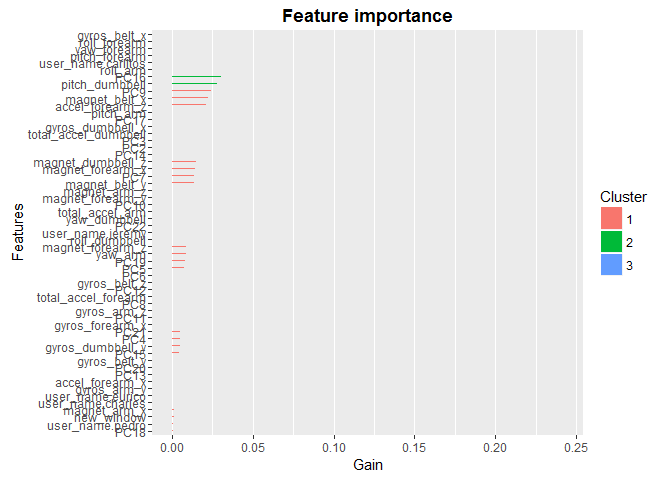
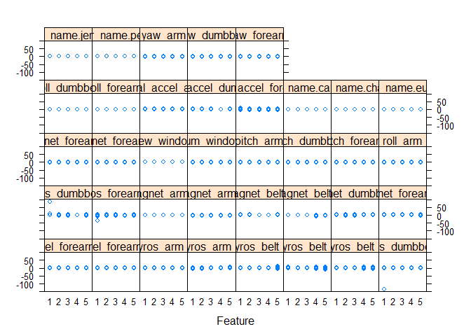
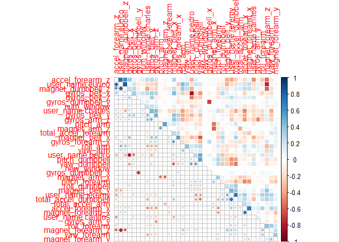
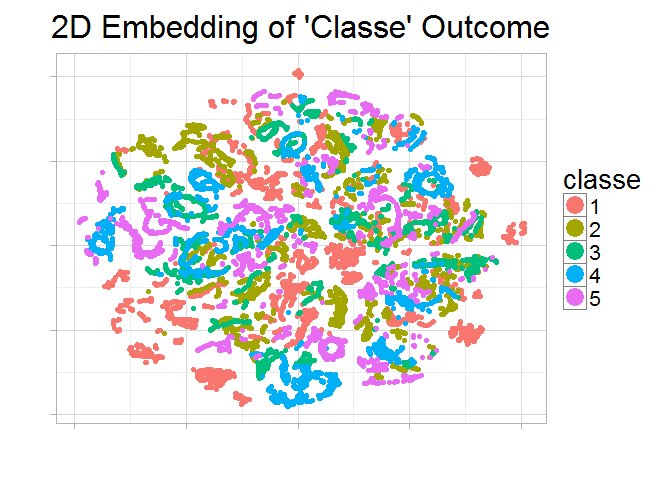

# Week4 Project
Kyu Cho  
February 18, 2016  

## Introduction
Using devices such as Jawbone Up, Nike FuelBand, and Fitbit it is now possible to collect a large amount of data about personal activity relatively inexpensively. These type of devices are part of the quantified self movement - a group of enthusiasts who take measurements about themselves regularly to improve their health, to find patterns in their behavior, or because they are tech geeks. One thing that people regularly do is quantify how much of a particular activity they do, but they rarely quantify how well they do it. In this project, your goal will be to use data from accelerometers on the belt, forearm, arm, and dumbell of 6 participants. They were asked to perform barbell lifts correctly and incorrectly in 5 different ways. More information is available from the website here: http://groupware.les.inf.puc-rio.br/har (see the section on the Weight Lifting Exercise Dataset).


## Data
The training data for this project are available here:  
https://d396qusza40orc.cloudfront.net/predmachlearn/pml-training.csv  

The test data are available here:  
https://d396qusza40orc.cloudfront.net/predmachlearn/pml-testing.csv  

The data for this project come from this source:   http://groupware.les.inf.puc-rio.br/har. If you use the document you create for this class for any purpose please cite them as they have been very generous in allowing their data to be used for this kind of assignment. 

## Goal
The goal of your project is to predict the manner in which they did the exercise. This is the "classe" variable in the training set. You may use any of the other variables to predict with.  
You should create a report describing 
1. how you built your model,  
2. how you used cross validation,  
3. what you think the expected out of sample error is, 
4. why you made the choices you did.  


## Cross-Validation Function
This function is to cross validate the testing model for tunning some parameters 


```r
cv.kfold <- function(data.df) {
     data.df <- train.cv
     param <- list(
          objective = "multi:softmax",     # multiclass classification 
          booster = "gbtree",              # gbtree or gblinear
          eta = 0.1,                       # lower value to avoid overfitting
          subsample = 0.5,                 # .5 for randome selctiong to avoid overfitting
          max_depth = 11,                  # maximum depth of tree, default 6
          # eval_metric = "auc",           # evaluation metric
          nthread = 8,                     # number of threads to be used
          gamma  = 0.1,                    # loss reduction required to make a further partition on leafe node
          eta = 0.02,                      # step size shrinkage, control the learning rate
          subsample = 0.9524,              # part of data instances to grow tree
          colsample_bytree = 0.5040,       # subsample ratio of columns when constructing each tree
          min_child_weight = 7,            # minimum sum of instance weight needed in a child
          silent = 0,
          num_class = length(levels(data.df$classe))
          )
     
     # Initialization
     acc.total <- c()
     target <- 'classe'
     predictors <- setdiff(names(data.df), target)
     
     # Shuffling
     set.seed(1234)
     data.df <- data.df[sample(nrow(data.df)), ]
     
     k <- 5  # k-fold cv
     for (i in 1:k) {
          # print(paste('cv',i))
          idx <- (((i-1) * round((1/k)*nrow(data.df))) + 1):((i*round((1/k) * nrow(data.df))))
          pca.train <- data.df[-idx,]
          pca.test <- data.df[idx,]
          
          # xgboost
           train.sparse <- sparse.model.matrix(classe ~ ., data = pca.train)
           test.sparse <- sparse.model.matrix(~ ., data = pca.test)
           trainMatrix <- xgb.DMatrix(data = train.sparse, 
                                      label = as.numeric(pca.train$classe) - 1, missing = NA)
           testMatrix <- xgb.DMatrix(data = test.sparse)
           
           mdl.cv <- xgb.train(data = trainMatrix, params = param, nrounds = 60)
           pred <- as.numeric(predict(mdl.cv, testMatrix)) + 1
           acc.cv <- confusionMatrix(pred, pca.test$classe)$overall["Accuracy"]
          
          # K-nearest neighbor
#          mdl.knn <- knn(train = pca.train[ ,predictors], 
#                         test = pca.test[ ,predictors], 
#                         cl = pca.train[ ,target], k=5)
#          pred.knn <- mdl.knn
#          acc.cv <- confusionMatrix(pred.knn, pca.test$classe)$overall["Accuracy"]
          
          acc.total <- c(acc.total, acc.cv)
     }
     return(mean(acc.total))
}
```


## Loading Data

```r
setwd("E:/Google Drive/College/1-Data Science/15-Practical Machine Learning/data")
# load raw data 
# Some missing values are coded as string "#DIV/0!" or "" or "NA" - these will be changed to NA.
train <- read.csv("pml-training.csv", na.strings=c("NA","#DIV/0!", ""), row.names = 1)
test <-read.csv('pml-testing.csv',na.strings=c("NA","#DIV/0!", ""), row.names = 1)
```


## Cleaning Data
After studying the summary of the training data, a number of cleaning actions are undertaken: 

- Remove columns with over a 90% of not a number 
- Remove near zero variance predictors 
- Remove not relevant columns for classification (x, user name, raw time stamp 1 and 2, new window and num window). 
- Convert class into factor 


```r
# Remove not relevant columns for classification
col.remove <- c("raw_timestamp_part_1", "raw_timestamp_part_2", "cvtd_timestamp")
train <- train[,!(names(train) %in% col.remove)]

# Remove columns with over a 90% of not a number
nasPerColumn <- apply(train, 2, function(x) {sum(is.na(x))});
train <- train[ ,which(nasPerColumn <  nrow(train)*0.9)];  

# Keep same columns as train set
target <- "classe"
col.keep <- names(train)[names(train) != target]
test <- test[,col.keep]

# Factor variables into dummy variables
dummies.train <- dummyVars( ~ user_name, data = train, fullRank=T)
dummies.test <- dummyVars( ~ user_name, data = test, fullRank=T)
train.dummies <- as.data.frame(predict(dummies.train, train))
test.dummies <- as.data.frame(predict(dummies.test, test))
train$user_name <- NULL
test$user_name <- NULL

train.dummies$new_window <- as.numeric(ifelse(train$new_window == 'yes', 1, 0))
test.dummies$new_window <- as.numeric(ifelse(test$new_window == 'yes', 1, 0))
train$new_window <- NULL
test$new_window <- NULL


# Remove highly correlated predictors
target <- 'classe'
predictors <- setdiff(names(train), target)

descr.cor.train <- cor(train[ ,predictors])
high.cor.descr.train <- findCorrelation(descr.cor.train, cutoff = .7)
low.cor.train <- train[ ,-high.cor.descr.train]
high.cor.train <- train[ ,high.cor.descr.train]

low.cor.test <- test[,-high.cor.descr.train]
high.cor.test <- test[ ,high.cor.descr.train]


# Remove near zero variance predictors
# nearZeroColumns <- nearZeroVar(train, saveMetrics = TRUE)
# train <- train[, nearZeroColumns$nzv == FALSE]
# train.zeroVar <- as.data.frame(train[, nearZeroColumns$nzv == TRUE])

# Check if there are linear dependecies
# findLinearCombos(train.lowcl[ ,predictors])


# Centering and Scaling
preproc.train <- preProcess(low.cor.train, method = c("center", "scale"))
train.scaled <- predict(preproc.train, low.cor.train)
train.scaled  <- cbind(train.dummies, train.scaled)

test.scaled <- predict(preproc.train, low.cor.test)
test.scaled  <- cbind(test.dummies, test.scaled)


# Since xgboost can only handle the numeric variables, outcome variables should be numeric veriables.
outcome <- train[ ,target]
n.class <- length(levels(outcome))
levels(outcome) <- 1:n.class
train.scaled$classe <- outcome

# Check if there are variables with missing values
# sapply(train.scaled, function(df) {
#      sum(is.na(df)==TRUE)/ length(df)})
```


## PCA / Feature Selection

Principal component analysis (PCA) is a statistical procedure that uses an orthogonal transformation to convert a set of observations of possibly correlated variables into a set of values of linearly uncorrelated variables called principal components. 

This time, we will use PCA variables with xgboost model and see the best number of features to be included in the model by using cross-validation. 


```r
# Combind data set with high correlated df, zero variability df to make perform PCA
# train.pca  <- cbind(train.highcl, train.zeroVar)
train.pca <- high.cor.train
test.pca <- high.cor.test

# Finding the best set of features by using CV
min = 20     # Chance this value
max = ncol(train.pca)
iterators <- seq(min, max, 1)
acc.total <- c()
for (i in iterators) { 
     pre.proc.obj <- preProcess(train.pca, method = c("pca", "center", "scale") , pcaComp = i)
     train.pca.scaled <- predict(pre.proc.obj, train.pca)
     train.cv <- cbind(train.pca.scaled, train.scaled)
     acc.total <- c(acc.total, cv.kfold(train.cv))
}
result.pca <- cbind(iterators, acc.total)
result.df <- result.pca[order(-result.pca[, "acc.total"]),] 
result.df
```

```
##      iterators acc.total
## [1,]        22 0.9944954
## [2,]        20 0.9939348
## [3,]        21 0.9935780
```

```r
best.num <- result.df[1,1]
print(paste("Best number of PCA :",best.num))
```

```
## [1] "Best number of PCA : 22"
```

```r
pre.proc.obj <- preProcess(train.pca, method = c("pca", "center", "scale") , pcaComp = best.num)
train.pca.scaled <- predict(pre.proc.obj, train.pca)
test.pca.scaled <- predict(pre.proc.obj, test.pca)
train.tf <- cbind(train.pca.scaled, train.scaled)
test.tf <- cbind(test.pca.scaled, test.scaled)
```


## Variables importance
Given the final model, the importance of the variables in this model can be studied. 
Then we will decide the number of features to be dropped by using cross-validation which will imporved the model.   


```r
# xgboost (Extreme Gradient Boosting)
# xgboost only takes matrix input, so we need some cleaning
train.sparse.tf <- sparse.model.matrix(classe ~ ., data = train.tf)
train.mtx <- xgb.DMatrix(data = train.sparse.tf, label = as.numeric(train.tf$classe) - 1, missing = NA)

param <- list(
     objective = "multi:softmax",     # multiclass classification 
     booster = "gbtree",              # gbtree or gblinear
     eta = 0.1,                       # lower value to avoid overfitting
     subsample = 0.5,                 # .5 for randome selctiong to avoid overfitting
     max_depth = 11,                  # maximum depth of tree, default 6
     # eval_metric = "auc",           # evaluation metric
     nthread = 8,                     # number of threads to be used
     gamma  = 0.1,                    # loss reduction required to make a further partition on leafe node
     eta = 0.02,                      # step size shrinkage, control the learning rate
     colsample_bytree = 0.5,          # subsample ratio of columns when constructing each tree
     min_child_weight = 7,            # minimum sum of instance weight needed in a child
     silent = 0,
     num_class = length(levels(train.tf$classe)))
set.seed(1234)
mdl.xgb <- xgb.train(data = train.mtx, params = param, nrounds = 100)

target <- c('classe')
predictors <- setdiff(names(train.tf), target)

# plot the important values
imp.var.mtx <- xgb.importance(predictors, model = mdl.xgb)
xgb.plot.importance(imp.var.mtx)
```

\

```r
# Removing unnecessary features by using CV
acc.total2 <- c()
iterators2 <- seq(0.002, 0.010, by = 0.002)
for (i in iterators2) {
     col.remove <- subset(imp.var.mtx, imp.var.mtx$Gain < i)$Feature
     train.cv.prned <- train.tf[,!(names(train.tf) %in% col.remove)]
     acc.total2 <- c(acc.total2, cv.kfold(train.cv.prned))
}
result.prund <- cbind(iterators2, acc.total2)
result.df2 <- result.prund[order(-result.prund[, "acc.total2"]),] 
result.df2
```

```
##      iterators2 acc.total2
## [1,]      0.002  0.9944954
## [2,]      0.004  0.9944954
## [3,]      0.006  0.9944954
## [4,]      0.008  0.9944954
## [5,]      0.010  0.9944954
```

```r
best.num2 <- result.df2[1,1]
print(paste("Best threshold for Var Imp :",best.num2))
```

```
## [1] "Best threshold for Var Imp : 0.002"
```

```r
col.remove <- subset(imp.var.mtx, imp.var.mtx$Gain < best.num2)$Feature
train.tf <- train.tf[,!(names(train.tf) %in% col.remove)]
target <- "classe"
col.keep <- names(train.tf)[names(train.tf) != target]
test.tf <- test.tf[,col.keep]
```


## Visualization for Cleaned Data
To make sure every variables is ready to be used, it is necessary to visualize the outcomes. 
1. We will first use feature plot to see every variables are normalized. 
2. Then see the correlation plot to see there aren't highly correlated variables. 
3. Lastly, by using tSNE function to see the clustering groups in 2D model. 


```r
target <- c('classe')
predictors <- setdiff(names(train.scaled), target)

# Feature Plot (sclaed, normalized)
featurePlot(train.scaled[,predictors], train.scaled$classe, "strip")
```

\

```r
# Correlation Plot (highly correlated features are removed)
corrplot.mixed(cor(train.scaled[,predictors]), 
               lower = "circle", upper = "color",
               tl.pos = "lt", diag = "n", order = "hclust",
               hclust.method = "complete")
```

\

```r
# tSNE plot (clustering field should be well classified)
# A tSNE (t-Distributed Stochastic Neighbor Embedding) is to reduce the multidimensional 2D.
predictors <- setdiff(names(train.tf), target)
tsne = Rtsne(as.matrix(train.tf[, predictors]), 
             check_duplicates = FALSE, pca = FALSE, 
             perplexity = 30, theta = 0.5, dims = 2)
embedding = as.data.frame(tsne$Y)
embedding$classe = train.tf$classe
s = ggplot(embedding, aes(x = V1, y = V2,color = classe)) +
     geom_point(size = 1.25) +
     guides(colour = guide_legend(override.aes = list(size = 6))) +
     xlab("") + ylab("") +
     ggtitle("2D Embedding of 'Classe' Outcome") +
     theme_light(base_size = 20) +
     theme(axis.text.x = element_blank(),
           axis.text.y = element_blank())
print(s)
```

\


## Ensembling by Bagging / Stacking
Bagging (stands for Bootstrap Aggregation) is the way decrease the variance of your prediction by generating additional data for training from your original dataset using combinations with repetitions to produce multisets of the same cardinality/size as your original data.
Bagging method gets the cross validation for free. 

Stacking is a similar to boosting: you also apply several models to you original data. The difference here is, however, that you don't have just an empirical formula for your weight function, rather you introduce a meta-level and use another model/approach to estimate the input together with outputs of every model to estimate the weights or, in other words, to determine what models perform well and what badly given these input data. 

In this project, I will use the combination of all ensembling technique. 


```r
#setup parallel back end to use 8 processors
cl <- makeCluster(8)
registerDoParallel(cl)

predictions <- c()
time.mdl <- system.time(
predictions <- foreach(m = 1:10, .combine = cbind) %dopar% {
     require(caret) # ML
     require(randomForest) # rf
     require(e1071) # svm
     require(class) # knn
     require(xgboost) #xgboost
     require(Matrix)
     
     target <- c('classe')
     predictors <- setdiff(names(train.tf), target)
     
     # shuffle by row
     train.tf <- train.tf[sample(nrow(train.tf)), ]
     submission <- T
     if (submission == T) {
          validation <- test.tf
          inTrain <- createDataPartition(y = train.tf$classe, p = 0.7,list = FALSE)
          training <- train.tf[inTrain, ]; 
          testing <- train.tf[-inTrain, ]
     } else {
          inBuild <- createDataPartition(y = train.tf$classe, p = 0.7,list = FALSE)
          validation <- train.tf[-inBuild, ]; 
          buildData <- train.tf[inBuild, ]
          
          inTrain <- createDataPartition(y = buildData$classe, p = 0.7,list = FALSE)
          training <- buildData[inTrain, ]; 
          testing <- buildData[-inTrain, ]
     }
     
     
     ###########################################################
     # Modeling 01 with original data
     ###########################################################
     # rf (RandomForest)
     mdl.rf <- randomForest(classe ~ ., 
                            data = training, 
                            replace = F, ntree = 100,
                            do.trace = F, mtry = 7)
     # svm (Support Vector Machine)
     mdl.svm <- svm(classe ~ .,
                   data = training,
                   kernel = "radial",
                   cost = 1,
                   gamma = 1/ncol(training))
     # knn (K nearest neighbor)
     pred.knn.test <- knn(train = training[ ,predictors], 
                    test = testing[ ,predictors], 
                    cl = training[ ,target], 
                    k=5)
     pred.knn.val <- knn(train = training[ ,predictors], 
                    test = validation[ ,predictors], 
                    cl = training[ ,target], 
                    k=5)
     # xgboost (Extreme Gradient Boosting)
     training.sparse <- sparse.model.matrix(classe ~ ., data = training)
     training.mtx <- xgb.DMatrix(data = training.sparse, 
                                 label = as.numeric(training$classe)-1, missing=NA)
     testing.sparse <- sparse.model.matrix(~ ., data = testing)
     testing.mtx <- xgb.DMatrix(data = testing.sparse)
     param <- list(
          objective = "multi:softmax",     # multiclass classification 
          booster = "gbtree",              # gbtree or gblinear
          eta = 0.1,                       # lower value to avoid overfitting
          subsample = 0.5,                 # .5 for randome selctiong to avoid overfitting
          max_depth = 11,                  # maximum depth of tree, default 6
          nthread = 8,                     # number of threads to be used
          min_child_weight = 10,           # minimum sum of instance weight needed in a child
          silent = 0,
          num_class = length(levels(training$classe)))
     mdl.xgb <- xgb.train(data = training.mtx, params = param, nrounds = 60)
     
     
     ###########################################################
     # Predicting 01 with testing data then combind prections
     ###########################################################
     pred.rf.test <- predict(mdl.rf, testing)
     pred.svm.test <- predict(mdl.svm, testing)
     pred.knn.test <- pred.knn.test
     pred.xgb.test <- as.numeric(predict(mdl.xgb, testing.mtx))+1
     combinedTestData <- data.frame(pred.rf.test = pred.rf.test,
                                    pred.svm.test = pred.svm.test,
                                    pred.knn.test = pred.knn.test,
                                    pred.xgb.test = pred.xgb.test,
                                    classe = testing$classe)
  
     
     ###########################################################
     # Moelding 02 with combinded tested predictions
     ###########################################################
     comb.test.sparse <- sparse.model.matrix(classe ~ ., data = combinedTestData)
     comb.test.mtx <- xgb.DMatrix(data = comb.test.sparse, 
                                  label = as.numeric(combinedTestData$classe)-1, missing=NA)
     val.sparse <- sparse.model.matrix(~ ., data = validation)
     val.mtx <- xgb.DMatrix(data = val.sparse)
     comb.fit <- xgb.train(data = comb.test.mtx, params = param, nrounds = 100)
     comb.pred.test <- as.numeric(predict(comb.fit, comb.test.mtx))+1
     
     
     ###########################################################
     # Predicting 02 with validation data then combind prections
     ###########################################################
     pred.rf.val <- predict(mdl.rf, validation)
     pred.svm.val <- predict(mdl.svm, validation)
     pred.knn.val <- pred.knn.val
     pred.xgb.val <- as.numeric(predict(mdl.xgb, val.mtx))+1
     combinedValData <- data.frame(pred.rf.val = pred.rf.val,
                                   pred.svm.val = pred.svm.val,
                                   pred.knn.val = pred.knn.val,
                                   pred.xgb.val = pred.xgb.val)
     
     
     ###########################################################
     # Prediction 03 with combined validation data for the final
     ###########################################################
     comb.val.sparse <- sparse.model.matrix(~ ., data = combinedValData)
     comb.val.mtx <- xgb.DMatrix(data = comb.val.sparse)
     comb.pred.val <- as.numeric(predict(comb.fit, comb.val.mtx))+1
     
     predictions <- cbind(predictions, comb.pred.val)
})
stopCluster(cl)

# Cleaning Somedata
pred.df <- as.data.frame(predictions) 
colnames(pred.df) <- NULL
pred.df <- as.data.frame(t(pred.df))
```


## Ensemblinig by Boosting method

Boosting is an approach to calculate the output using several different models and then average the result using a weighted average approach. By combining the advantages and pitfalls of these approaches by varying your weighting formula you can come up with a good predictive force for a wider range of input data, using different narrowly tuned models.


```r
# Extracting the highest probability predictions
pred.wted <- c()  # wegihted prediction
for (i in seq(1, length(pred.df), 1)) {
     pred.tbl.df <- as.data.frame(table(pred.df[,i])) 
     idx <- which(pred.tbl.df$Freq == max(pred.tbl.df$Freq))
     pred.wted <- c(pred.wted, as.vector(pred.tbl.df[idx,]$Var1[1]))
}

x <- c()
for (i in seq(1, length(pred.wted), 1)){
     val <- pred.wted[i]
     if(val == 1) x <- c(x, "A")
     if(val == 2) x <- c(x, "B")
     if(val == 3) x <- c(x, "C")
     if(val == 4) x <- c(x, "D")
     if(val == 5) x <- c(x, "E")
}
pred.final <- x
print(paste(pred.final))
```

```
##  [1] "B" "A" "B" "A" "A" "E" "D" "B" "A" "A" "B" "C" "B" "A" "E" "E" "A"
## [18] "B" "B" "B"
```


## Writing Submission


```r
write.submission = function(x){
     filename = paste0("project_submmission",".txt")
     write.table(x, file = filename, quote = FALSE, row.names = FALSE, col.names = FALSE)
}
write.submission(pred.final)
```


