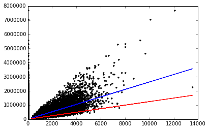

# Regression Week 4: Ridge Regression (gradient descent)

In this notebook, you will implement ridge regression via gradient descent. You will:
* Convert an SFrame into a Numpy array
* Write a Numpy function to compute the derivative of the regression weights with respect to a single feature
* Write gradient descent function to compute the regression weights given an initial weight vector, step size, tolerance, and L2 penalty

# Fire up graphlab create

Make sure you have the latest version of GraphLab Create (>= 1.7)


```python
import graphlab
import os
os.chdir('C:\Users\Kyu\Documents\python\data')
```

# Load in house sales data

Dataset is from house sales in King County, the region where the city of Seattle, WA is located.


```python
sales = graphlab.SFrame('kc_house_data.gl/')
```

    [INFO] 1452605741 : INFO:     (initialize_globals_from_environment:282): Setting configuration variable GRAPHLAB_FILEIO_ALTERNATIVE_SSL_CERT_FILE to C:\Users\Kyu\AppData\Local\Dato\Dato Launcher\lib\site-packages\certifi\cacert.pem
    1452605741 : INFO:     (initialize_globals_from_environment:282): Setting configuration variable GRAPHLAB_FILEIO_ALTERNATIVE_SSL_CERT_DIR to 
    This non-commercial license of GraphLab Create is assigned to chok20734@gmail.com and will expire on October 03, 2016. For commercial licensing options, visit https://dato.com/buy/.
    
    [INFO] Start server at: ipc:///tmp/graphlab_server-7044 - Server binary: C:\Users\Kyu\AppData\Local\Dato\Dato Launcher\lib\site-packages\graphlab\unity_server.exe - Server log: C:\Users\Kyu\AppData\Local\Temp\graphlab_server_1452605741.log.0
    [INFO] GraphLab Server Version: 1.7.1
    

If we want to do any "feature engineering" like creating new features or adjusting existing ones we should do this directly using the SFrames as seen in the first notebook of Week 2. For this notebook, however, we will work with the existing features.

# Import useful functions from previous notebook

As in Week 2, we convert the SFrame into a 2D Numpy array. Copy and paste `get_num_data()` from the second notebook of Week 2.


```python
import numpy as np # note this allows us to refer to numpy as np instead 
```


```python
def get_numpy_data(data_sframe, features, output):
    data_sframe['constant'] = 1 # this is how you add a constant column to an SFrame
    
    # add the column 'constant' to the front of the features list so that we can extract it along with the others:
    features = ['constant'] + features # this is how you combine two lists
    
    # select the columns of data_SFrame given by the features list into the SFrame features_sframe (now including constant):
    features_sframe = data_sframe[features]
    
    # the following line will convert the features_SFrame into a numpy matrix:
    feature_matrix = features_sframe.to_numpy()
    
    # assign the column of data_sframe associated with the output to the SArray output_sarray
    output_sarray = data_sframe[output]
    
    # the following will convert the SArray into a numpy array by first converting it to a list
    output_array = output_sarray.to_numpy()
    
    return(feature_matrix, output_array)
```


```python
(example_features, example_output) = get_numpy_data(sales, ['sqft_living'], 'price') # the [] around 'sqft_living' makes it a list
print example_features[0,:] # this accesses the first row of the data the ':' indicates 'all columns'
print example_output[0] # and the corresponding output
```

    [  1.00000000e+00   1.18000000e+03]
    221900.0
    

Also, copy and paste the `predict_output()` function to compute the predictions for an entire matrix of features given the matrix and the weights:


```python
def predict_output(feature_matrix, weights):
    # assume feature_matrix is a numpy matrix containing the features as columns and weights is a corresponding numpy array
    # create the predictions vector by using np.dot()
    predictions = np.dot(feature_matrix, weights)
    return(predictions)
```


```python
my_weights = np.array([1., 1.]) # the example weights
my_features = example_features[0,] # we'll use the first data point
predicted_value = np.dot(my_features, my_weights)
print predicted_value

test_predictions = predict_output(example_features, my_weights)
print test_predictions[0] # should be 1181.0
print test_predictions[1] # should be 2571.0
```

    1181.0
    1181.0
    2571.0
    

# Computing the Derivative

We are now going to move to computing the derivative of the regression cost function. Recall that the cost function is the sum over the data points of the squared difference between an observed output and a predicted output, plus the L2 penalty term.
```
Cost(w)
= SUM[ (prediction - output)^2 ]
+ l2_penalty*(w[0]^2 + w[1]^2 + ... + w[k]^2).
```

Since the derivative of a sum is the sum of the derivatives, we can take the derivative of the first part (the RSS) as we did in the notebook for the unregularized case in Week 2 and add the derivative of the regularization part.  As we saw, the derivative of the RSS with respect to `w[i]` can be written as: 
```
2*SUM[ error*[feature_i] ].
```
The derivative of the regularization term with respect to `w[i]` is:
```
2*l2_penalty*w[i].
```
Summing both, we get
```
2*SUM[ error*[feature_i] ] + 2*l2_penalty*w[i].
```
That is, the derivative for the weight for feature i is the sum (over data points) of 2 times the product of the error and the feature itself, plus `2*l2_penalty*w[i]`. 

**We will not regularize the constant.**  Thus, in the case of the constant, the derivative is just twice the sum of the errors (without the `2*l2_penalty*w[0]` term).

Recall that twice the sum of the product of two vectors is just twice the dot product of the two vectors. Therefore the derivative for the weight for feature_i is just two times the dot product between the values of feature_i and the current errors, plus `2*l2_penalty*w[i]`.

With this in mind complete the following derivative function which computes the derivative of the weight given the value of the feature (over all data points) and the errors (over all data points).  To decide when to we are dealing with the constant (so we don't regularize it) we added the extra parameter to the call `feature_is_constant` which you should set to `True` when computing the derivative of the constant and `False` otherwise.


```python
def feature_derivative_ridge(errors, feature, weight, l2_penalty, feature_is_constant):
    # If feature_is_constant is True, derivative is twice the dot product of errors and feature
    if feature_is_constant == True:
        derivative = 2* np.dot(errors, feature)
    # Otherwise, derivative is twice the dot product plus 2*l2_penalty*weight
    else:
        derivative = 2*np.dot(errors, feature) + 2*l2_penalty*weight
    return derivative
```

To test your feature derivartive run the following:


```python
(example_features, example_output) = get_numpy_data(sales, ['sqft_living'], 'price') 
my_weights = np.array([1., 10.])
test_predictions = predict_output(example_features, my_weights) 
errors = test_predictions - example_output # prediction errors

# next two lines should print the same values
print feature_derivative_ridge(errors, example_features[:,1], my_weights[1], 1, False)
print np.sum(errors*example_features[:,1])*2+20.
print ''

# next two lines should print the same values
print feature_derivative_ridge(errors, example_features[:,0], my_weights[0], 1, True)
print np.sum(errors)*2.
```

    -5.65541667824e+13
    -5.65541667824e+13
    
    -22446749336.0
    -22446749336.0
    

# Gradient Descent

Now we will write a function that performs a gradient descent. The basic premise is simple. Given a starting point we update the current weights by moving in the negative gradient direction. Recall that the gradient is the direction of *increase* and therefore the negative gradient is the direction of *decrease* and we're trying to *minimize* a cost function. 

The amount by which we move in the negative gradient *direction*  is called the 'step size'. We stop when we are 'sufficiently close' to the optimum. Unlike in Week 2, this time we will set a **maximum number of iterations** and take gradient steps until we reach this maximum number. If no maximum number is supplied, the maximum should be set 100 by default. (Use default parameter values in Python.)

With this in mind, complete the following gradient descent function below using your derivative function above. For each step in the gradient descent, we update the weight for each feature before computing our stopping criteria.


```python
def ridge_regression_gradient_descent(feature_matrix, output, initial_weights, step_size, l2_penalty, max_iterations = 100):
    weights = np.array(initial_weights) #making sure it's a numpy array
    iteration = 0   
    
    #while not reached maximum number of iterations:
    while iteration <= max_iterations:
        # compute the predictions based on feature_matrix and weights using predict_output()
        predictions = predict_output(feature_matrix, weights)
        
        # compute the errors 
        errors = predictions - output
        
        # Recall that feature_matrix[:,i] is the feature column associated with weights[i]
        # compute the derivative for weight[i].
        #(Remember: when i=0, you are computing the derivative of the constant!)
        for i in xrange(len(weights)): # loop over each weight
            if i == 0:
                derivative = feature_derivative_ridge(errors, feature_matrix[:, i], weights[i], 0.0, True)
                weights[i] -= step_size*derivative
            else:
                derivative = feature_derivative_ridge(errors, feature_matrix[:, i], weights[i], l2_penalty, False)
                weights[i] -= step_size*derivative
        iteration += 1
    return weights
```

# Visualizing effect of L2 penalty

The L2 penalty gets its name because it causes weights to have small L2 norms than otherwise. Let's see how large weights get penalized. Let us consider a simple model with 1 feature:


```python
simple_features = ['sqft_living']
my_output = 'price'
```

Let us split the dataset into training set and test set. Make sure to use `seed=0`:


```python
train_data,test_data = sales.random_split(.8,seed=0)
```

In this part, we will only use `'sqft_living'` to predict `'price'`. Use the `get_numpy_data` function to get a Numpy versions of your data with only this feature, for both the `train_data` and the `test_data`. 


```python
(simple_feature_matrix, output) = get_numpy_data(train_data, simple_features, my_output)
(simple_test_feature_matrix, test_output) = get_numpy_data(test_data, simple_features, my_output)
```

Let's set the parameters for our optimization:


```python
initial_weights = np.array([0., 0.])
step_size = 1e-12
max_iterations=1000
```

First, let's consider no regularization.  Set the `l2_penalty` to `0.0` and run your ridge regression algorithm to learn the weights of your model.  Call your weights:

`simple_weights_0_penalty`

we'll use them later.


```python
simple_weights_0_penalty = ridge_regression_gradient_descent(simple_feature_matrix, 
                                                             output, initial_weights,
                                                             step_size, 0.0, max_iterations = 100)
simple_weights_0_penalty
```


    array([  7.85511563e-02,   2.63024271e+02])


Next, let's consider high regularization.  Set the `l2_penalty` to `1e11` and run your ridge regression algorithm to learn the weights of your model.  Call your weights:

`simple_weights_high_penalty`

we'll use them later.


```python
simple_weights_high_penalty = ridge_regression_gradient_descent(simple_feature_matrix, 
                                                                output, initial_weights, 
                                                                step_size, 1e11, max_iterations = 100)
simple_weights_high_penalty
```


    array([   1.00782291,  124.57384288])


This code will plot the two learned models.  (The blue line is for the model with no regularization and the red line is for the one with high regularization.)


```python
import matplotlib.pyplot as plt
%matplotlib inline
plt.plot(simple_feature_matrix,output,'k.',
         simple_feature_matrix,predict_output(simple_feature_matrix, simple_weights_0_penalty),'b-',
        simple_feature_matrix,predict_output(simple_feature_matrix, simple_weights_high_penalty),'r-')
```


    [<matplotlib.lines.Line2D at 0x1f8bc320>,
     <matplotlib.lines.Line2D at 0x1f8bc550>,
     <matplotlib.lines.Line2D at 0x1f8bc710>,
     <matplotlib.lines.Line2D at 0x1f9590b8>,
     <matplotlib.lines.Line2D at 0x1f959240>,
     <matplotlib.lines.Line2D at 0x1f959ba8>]





Compute the RSS on the TEST data for the following three sets of weights:
1. The initial weights (all zeros)
2. The weights learned with no regularization
3. The weights learned with high regularization

Which weights perform best?


```python
initial_rss = ((test_output - predict_output(simple_test_feature_matrix, initial_weights))**2).sum()
print initial_rss
```

    1.78427328252e+15
    


```python

no_reg_rss = ((test_output - predict_output(simple_test_feature_matrix, simple_weights_0_penalty))**2).sum()
print no_reg_rss
```

    2.75723643923e+14
    


```python
high_reg_rss = ((test_output - predict_output(simple_test_feature_matrix, simple_weights_high_penalty))**2).sum()
print high_reg_rss
```

    6.94653077641e+14
    

***QUIZ QUESTIONS***
1. What is the value of the coefficient for `sqft_living` that you learned with no regularization, rounded to 1 decimal place?  What about the one with high regularization?
2. Comparing the lines you fit with the with no regularization versus high regularization, which one is steeper?
3. What are the RSS on the test data for each of the set of weights above (initial, no regularization, high regularization)? 


# Running a multiple regression with L2 penalty

Let us now consider a model with 2 features: `['sqft_living', 'sqft_living15']`.

First, create Numpy versions of your training and test data with these two features. 


```python
model_features = ['sqft_living', 'sqft_living15'] # sqft_living15 is the average squarefeet for the nearest 15 neighbors. 
my_output = 'price'
(feature_matrix, output) = get_numpy_data(train_data, model_features, my_output)
(test_feature_matrix, test_output) = get_numpy_data(test_data, model_features, my_output)
```

We need to re-inialize the weights, since we have one extra parameter. Let us also set the step size and maximum number of iterations.


```python
initial_weights = np.array([0.0,0.0,0.0])
step_size = 1e-12
max_iterations = 1000
```

First, let's consider no regularization.  Set the `l2_penalty` to `0.0` and run your ridge regression algorithm to learn the weights of your model.  Call your weights:

`multiple_weights_0_penalty`


```python
multiple_weights_0_penalty = ridge_regression_gradient_descent(feature_matrix, 
                                                               output, initial_weights, 
                                                               step_size, 0.0, max_iterations)
multiple_weights_0_penalty
```


    array([  -0.35780713,  243.0557255 ,   22.41312582])


Next, let's consider high regularization.  Set the `l2_penalty` to `1e11` and run your ridge regression algorithm to learn the weights of your model.  Call your weights:

`multiple_weights_high_penalty`


```python
multiple_weights_high_penalty = ridge_regression_gradient_descent(feature_matrix, 
                                                                  output, initial_weights, 
                                                                  step_size, 1e11, max_iterations)
multiple_weights_high_penalty
```


    array([  6.74968593,  91.48927271,  78.43658678])


Compute the RSS on the TEST data for the following three sets of weights:
1. The initial weights (all zeros)
2. The weights learned with no regularization
3. The weights learned with high regularization

Which weights perform best?


```python
mult_initial_rss = ((test_output - predict_output(test_feature_matrix, initial_weights))**2).sum()
print mult_initial_rss
```

    1.78427328252e+15
    


```python
mult_no_reg_rss = ((test_output - predict_output(test_feature_matrix, multiple_weights_0_penalty))**2).sum()
print mult_no_reg_rss
```

    2.74067694347e+14
    


```python
mult_high_reg_rss = ((test_output - predict_output(test_feature_matrix, multiple_weights_high_penalty))**2).sum()
print mult_high_reg_rss
```

    5.00404796858e+14
    

Predict the house price for the 1st house in the test set using the no regularization and high regularization models. (Remember that python starts indexing from 0.) How far is the prediction from the actual price?  Which weights perform best for the 1st house?


```python
house_price = test_output[0]
print(house_price)
```

    310000.0
    


```python
mult_0_predictions_test = predict_output(test_feature_matrix, multiple_weights_0_penalty)
mult_0_predictions_test[0]
```


    387464.69361981156


```python
mult_high_predictions_test = predict_output(test_feature_matrix, multiple_weights_high_penalty)
mult_high_predictions_test[0]
```


    270453.53412973066


***QUIZ QUESTIONS***
1. What is the value of the coefficient for `sqft_living` that you learned with no regularization, rounded to 1 decimal place?  What about the one with high regularization?
2. What are the RSS on the test data for each of the set of weights above (initial, no regularization, high regularization)? 
3. We make prediction for the first house in the test set using two sets of weights (no regularization vs high regularization). Which weights make better prediction <u>for that particular house</u>?


```python
print("No Regularization `sqft_living`: {0:.1f}".format(multiple_weights_0_penalty[1]))
print("High Regularization `sqft_living`: {0:.1f}".format(multiple_weights_high_penalty[1]))
```

    No Regularization `sqft_living`: 243.1
    High Regularization `sqft_living`: 91.5
    


```python
print("RSS Initial: {0}".format(mult_initial_rss))
print("RSS No regularization: {0}".format(mult_no_reg_rss))
print("RSS High Regularization: {0}".format(mult_high_reg_rss))
```

    RSS Initial: 1.78427328252e+15
    RSS No regularization: 2.74067694347e+14
    RSS High Regularization: 5.00404796858e+14
    


```python
if abs(mult_0_predictions_test[0] - house_price) > abs(mult_high_predictions_test[0] - house_price):
    print('High Regularization was closer to the real value')
else:
    print('no Regularization was closer to the real value')
print("High Regularization Error: {0}".format(abs(mult_high_predictions_test[0] - house_price)))
print("No Regularization Error: {0}".format(abs(mult_0_predictions_test[0] - house_price)))
```

    High Regularization was closer to the real value
    High Regularization Error: 39546.4658703
    No Regularization Error: 77464.6936198
    
