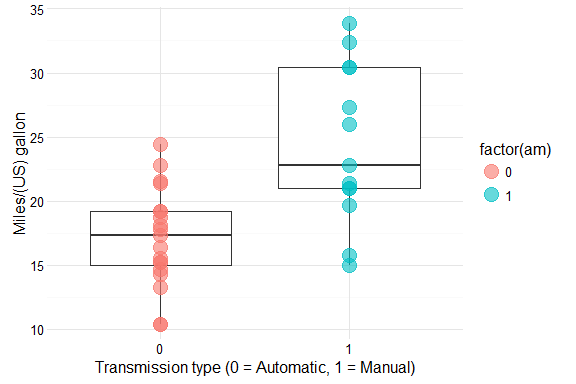
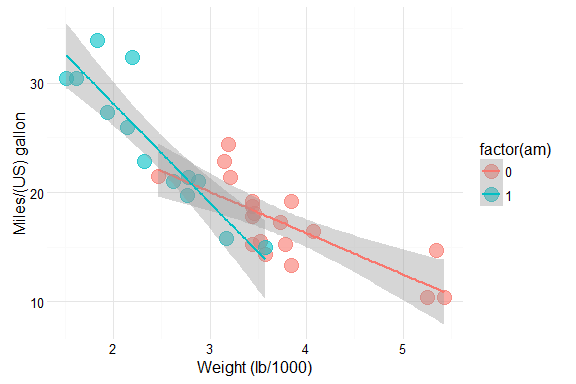
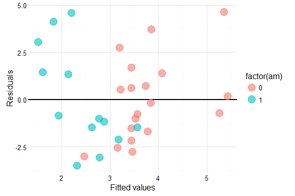
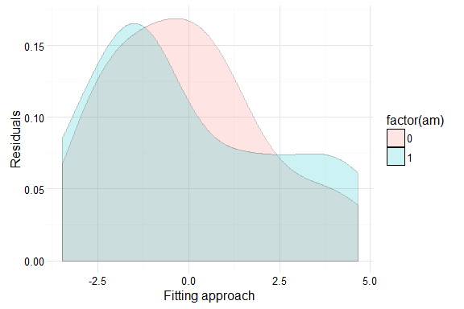
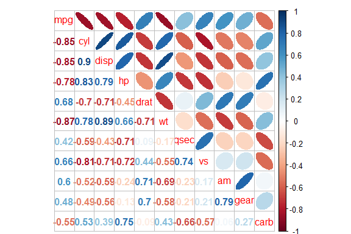

# Motor Trend: Estimating MPG
Kyu Cho  
February 8, 2016  


This edition of Motor Trend magazine explores the relationship between a set of variables and miles per gallon (MPG) for a collection of cars. In particular the following two questions are addressed:

* Is an automatic or manual transmission better for MPG?
* How to quantify the MPG difference between automatic and manual transmissions?

Source: mtcars {datasets} the data was extracted from the 1974 Motor Trend US magazine, and comprises
fuel consumption and 10 aspects of automobile design and performance for 32 automobiles (1973-74 models).


# Executive Summary

The article starts with an exploratory analysis in which a baseline model is established based on transmission
type alone. It is found that this model explains only 36% of the variance. In the data analysis that follows,
more variables are introduced in the model. The proposed formula for the best fit is mpg ~ 9.62 + 2.94 *
am - 3.92 * wt + 1.23 * qsec which explains 83% of the variance with a 95% confidence.


# Data Overview

The data set consists of a data frame with 32 observations on 11 variables. The first 4 entries of the data set are shown in table 1.


```r
head(mtcars, 4)
```

```
##                mpg cyl disp  hp drat  wt qsec vs am gear carb
## Mazda RX4       21   6  160 110  3.9 2.6   16  0  1    4    4
## Mazda RX4 Wag   21   6  160 110  3.9 2.9   17  0  1    4    4
## Datsun 710      23   4  108  93  3.8 2.3   19  1  1    4    1
## Hornet 4 Drive  21   6  258 110  3.1 3.2   19  1  0    3    1
```

# Exploratory Analysis

The first model to fit is an univariate model where MPG is predicted by the transmission type alone. This
provides a benchmark against which other models can be evaluated. The resulting coeff are listed in
table 2.


```r
fit0 <- lm(mpg ~ am, data = mtcars)
summary(fit0)$coefficients
```

```
##             Estimate Std. Error t value Pr(>|t|)
## (Intercept)     17.1        1.1    15.2  1.1e-15
## am               7.2        1.8     4.1  2.9e-04
```

This model estimates an expected 7.24 increase in MPG for cars with manual transmission compared to cars
with automatic transmission.
This claim is supported by the boxplot in figure 1 that shows the distribution of MPG per transmission type:
cars with automatic transmission have an average of 17.15 MPG (which is equal to the intercept), compared
to 24.39 MPG for cars with manual transmission.

The predictor is significant, due to its small p-value and a [3.64, 10.85] confidence interval. However, with
an R-squared of 0.36 it explains only 35.98% of the variance.


# Data Analysis

According to Newton's law of physics, more force is needed to move objects with a higher mass. This suggests that the weight of a car is of influence on its MPG. The next model incorporates both the transmission type and the cars' weight:


```r
fit1 <- lm(mpg ~ am + wt, data = mtcars)
summary(fit1)$coefficients
```

```
##             Estimate Std. Error t value Pr(>|t|)
## (Intercept)   37.322       3.05  12.218  5.8e-13
## am            -0.024       1.55  -0.015  9.9e-01
## wt            -5.353       0.79  -6.791  1.9e-07
```

Indeed, the weight appears to be a good predictor as indicated by the very small p-value. Furthermore, the
model explains 75.28% of the variance.
Another interesting observation is that one can see from the p-values in both models that holding the weight
constant, transmission type appears to much have less of an impact on MPG than if weight is disregarded.
This suggests that the weight of a car is far more important with respect to MPG than its transmission type.
After trying several other variables, qsec was selected as third argument in the model under the reasoning is
that the faster the car, the higher its fuel consumption and thus the less MPG. Table 4 lists the variance
table for the three models.


```r
fit2 <- lm(mpg ~ am + wt + qsec, data = mtcars)
anova(fit0, fit1, fit2)
```

```
## Analysis of Variance Table
## 
## Model 1: mpg ~ am
## Model 2: mpg ~ am + wt
## Model 3: mpg ~ am + wt + qsec
##   Res.Df RSS Df Sum of Sq    F  Pr(>F)    
## 1     30 721                              
## 2     29 278  1       443 73.2 2.7e-09 ***
## 3     28 169  1       109 18.0 0.00022 ***
## ---
## Signif. codes:  0 '***' 0.001 '**' 0.01 '*' 0.05 '.' 0.1 ' ' 1
```

Figure 3 shows some minor residual heteroskedacity and the distribution plot of the residuals of manual cars (Figure 4) shows a slight shift just to the left of the mean, indicating that the residuals of the regression do not appear biased with mean close to 0. 


# Conclusion

The third model, including `am`, `wt` and `qsec` as variables explains 84.97% of the variance. Additional variables did not pass the statistical significance test and/or did not contribute to variance of the model. 


\

\

\

\


```r
# Correlation
require(corrplot)
corrplot.mixed(cor(mtcars), lower="number", upper="ellipse")
```

\


```r
# Summary
par(mfrow=c(2,2))
plot(fit2)
```

\

